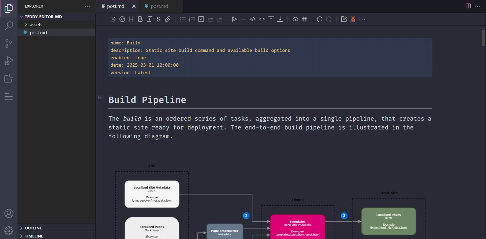
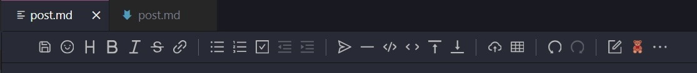

<h1>Teddy Editor</h1>

WYSIWYG markdown editor extension for Visual Studio Code (VS Code) seamlessly integrated with Teddy.

<a href="https://teddyful.com" target="_blank">teddyful.com</a>

## Table of Contents  
[1. Introduction](#introduction) 
[2. Prerequisites](#prerequisites) 
[3. Installation](#installation) 
[4. Configuration](#configuration) 
[5. Usage](#usage) 
[6. Credits](#credits) 
[7. Further Information](#information) 
 

## 1. Introduction

The Teddy Editor is a WYSIWYG markdown editor extension for Visual Studio Code (VS Code), forked from <a href="https://github.com/zaaack/vscode-markdown-editor" target="_blank">zaaack/vscode-markdown-editor</a>, that is seamlessly integrated with <a href="https://github.com/teddyful/teddy" target="_blank">Teddy</a>. It enables content editors to manage and build static sites, using Teddy, entirely within VS Code.

<a href="#readme-top">Back to Top &#9650;</a>

## 2. Prerequisites

Please ensure that the following required software services are installed in your environment.

* <a href="https://teddyful.com" target="_blank">Teddy</a> - Static site generator.
* <a href="https://code.visualstudio.com/" target="_blank">Visual Studio Code (VS Code)</a> - Source code editor.

<a href="#readme-top">Back to Top &#9650;</a>

## 3. Installation

### Marketplace Installation

To install the Teddy Editor extension via the Visual Studio marketplace (recommended), please follow the instructions below.

1. Open VS Code.
2. Select 'Extensions' from either the left menu, by selecting File > Preferences > Extensions, or by pressing CTRL + SHIFT + X.
3. In the search input box, search for and install 'Teddy Editor'.

The direct link to the extension in the Visual Studio marketplace is as follows: <a href="https://marketplace.visualstudio.com/items?itemName=teddyful.teddy-editor" target="_blank">https://marketplace.visualstudio.com/items?itemName=teddyful.teddy-editor</a>

### Manual Installation

To manually install the Teddy Editor extension, please follow the instructions below.

1. Visit https://github.com/teddyful/teddy-editor/releases
2. Dowload `teddy-editor-${version}.vsix`, where `${version}` is the latest release version of Teddy Editor.
3. Open VS Code.
4. Select 'Extensions' from either the left menu, by selecting File > Preferences > Extensions, or by pressing CTRL + SHIFT + X.
5. Select the three dots `...` besides the 'Extensions' title, and select 'Install from VSIX...'.
6. Navigate to and select the `teddy-editor-${version}.vsix` file that was downloaded in step 2.

<a href="#readme-top">Back to Top &#9650;</a>

## 4. Configuration

In order to build static sites using Teddy from within VS Code, the Teddy Editor extension must be properly configured.

1. Open VS Code.
2. Select File > Preferences > Settings.
3. Select Extensions > Teddy.
4. Under 'Teddy: Path', enter the absolute path to the local instance of Teddy (required).
5. Under 'Teddy: Site Name', enter the name of the site that you wish to build, for example `travelbook` (required).
6. Under 'Teddy: Theme Name', enter the name of the theme that you wish to use, for example `bear` (required).
7. Under 'Teddy: Build Options', enter any build options that you would like to use, for example `--env local --minify-html`. Please visit <a href="https://teddyful.com/docs/latest/build/" target="_blank">https://teddyful.com/docs/latest/build/</a> for a full list of available build options.

<a href="#readme-top">Back to Top &#9650;</a>

## 5. Usage

### Markdown Editor

To open the Teddy Editor, simply right-click on any markdown file in the Explorer view in VS Code, and select 'Open with Teddy' from the resultant context menu.

### Build

To build the configured static site, simply select the button with the Teddy icon found in the toolbar of the Teddy Editor.

<a href="#readme-top">Back to Top &#9650;</a>

## 6. Credits

Teddy Editor is a fork of the fantastic <a href="https://github.com/zaaack/vscode-markdown-editor" target="_blank">Markdown Editor</a> VS Code extension created by <a href="https://github.com/zaaack" target="_blank">Zack Young (zaaack)</a> which in turn uses the amazing <a href="https://github.com/Vanessa219/vditor" target="_blank">Vditor</a> in-browser Markdown editor. Please check out both of these wonderful open-source software projects and, if you are able, consider donating to them to support the awesome open-source community.

* <a href="https://github.com/Vanessa219/vditor" target="_blank">Vditor</a> - in-browser Markdown editor.
* <a href="https://github.com/zaaack/vscode-markdown-editor" target="_blank">Markdown Editor</a> - VS Code extension.

<a href="#readme-top">Back to Top &#9650;</a>

## 7. Further Information

For further information, please visit <a href="https://teddyful.com" target="_blank">teddyful.com</a>.

<a href="#readme-top">Back to Top &#9650;</a>

